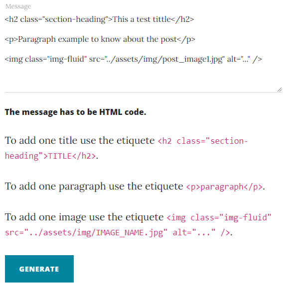
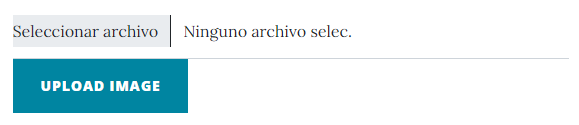

[![MIT License][license-shield]][license-url]
[![LinkedIn][linkedin-shield]][linkedin-url]

<!-- PROJECT LOGO -->
 

  

  <h3 align="center">Serverless Blog in AWS </h3>

  

    This project is one serveless blog created in AWS using S3, API Gateway and lambdas. 
     
     
    <a href="http://cqs-blog.s3-website.eu-central-1.amazonaws.com/">Demo</a>
  

  
Table of Contents

  <ol>
    <li>
      <a href="#about-the-project">About The Project</a>
      <ul>
        <li><a href="#built-with">Built With</a></li>
      </ul>
    </li>
    <li>
      <a href="#getting-started">Getting Started</a>
      <ul>
        <li><a href="#prerequisites">Prerequisites</a></li>
        <li><a href="#installation">Installation</a></li>
      </ul>
    </li>
    <li><a href="#usage">Usage</a></li>
    <li><a href="#roadmap">Roadmap</a></li>
    <li><a href="#contributing">Contributing</a></li>
    <li><a href="#license">License</a></li>
    <li><a href="#contact">Contact</a></li>
    <li><a href="#acknowledgments">Acknowledgments</a></li>
  </ol>

<!-- ABOUT THE PROJECT -->
## About The Project

The project is one blog creates in AWS to prevent the server software usage. This types of server could be a problem because they often be hacked.

This blog contribute a new scheme without tomcat, flask or other type of software to prevent the hacks in the web site. Of course, this solution is one example to show how we can prevent the these types of issues in our webs the most important part of the security is in AWS and how we create de IAM credentials and the configuation permissions of the AWS. 

So in this project there are:
* Hosting Static blog in S3
* The blog reads from S3 bucket the posts
* Upload images to S3 with public permissions
* HTML Generation with Lambda functions
* Save HTML files from Lambda to S3   

 The creation_from.html is disabled in the demo.!! 

(<a href="#top">back to top</a>)

<!-- BUILT STARTED -->
### Built With

This section list the frameworks/libraries used to create this blog. 

* [S3 AWS](https://aws.amazon.com/es/s3/)
* [API Gateway AWS](https://aws.amazon.com/es/api-gateway/)
* [Lambda AWS](https://aws.amazon.com/es/lambda/)
* [JavaScript](https://www.javascript.com/)
* [Bootstrap](https://getbootstrap.com)
* [JQuery](https://jquery.com)

(<a href="#top">back to top</a>)

<!-- GETTING STARTED -->
## Getting Started

In this section I talk you about how you can import this project to your AWS account to test it. 

### Prerequisites

This is an example of how to list things you need to use the software and how to install them.

* S3 configuration

You have to configure S3 with static host endpoint 
[Hosting Static in AWS](https://docs.aws.amazon.com/AmazonS3/latest/userguide/WebsiteHosting.html)

 All files in this bucket must be PUBLIC 

 
* IAM premissions

You must create one user to give permissions to put files in S3 you can use the file [PutObject.json](https://github.com/eduardfores/CQS_blog/blob/main/AWS_permissions/PutObject.json) to create these permissions. This user will used fom the Lambdea functions to generate the HTMLs. The ACCESS_KEY and SECRET_KEY have to be add in the python files in [AWS Lambda](https://github.com/eduardfores/CQS_blog/tree/main/AWS_lambda).

The credentials to read S3 from the HTML you have to fill the information of [credentialsS3.js](https://github.com/eduardfores/CQS_blog/blob/main/js/credentials/credentialsS3.js). In this case we don't need a user because we use the cognito-identity directly. The permisions for this new rol can be [ListObject.json](https://github.com/eduardfores/CQS_blog/blob/main/AWS_permissions/ListObject.json)

### Installation

_Below is the instructions to install the the application in AWS Step by step._

1. Upload all files related with the Web page in S3 bucket configured previouslly. [assests](https://github.com/eduardfores/CQS_blog/tree/main/assets), [css](https://github.com/eduardfores/CQS_blog/tree/main/css), [js] https://github.com/eduardfores/CQS_blog/tree/main/js, [lib](https://github.com/eduardfores/CQS_blog/tree/main/lib), [posts](https://github.com/eduardfores/CQS_blog/tree/main/posts) and all html files fro mthe root.

2. Create 1 lambda function to upload files from HTML and copy paste the [UploadHTMLFile.py](https://github.com/eduardfores/CQS_blog/blob/main/AWS_lambda/cqs-blog-uploadHtmlFile.py). Remember to add ACCESS_KEY and SECRET_KEY.

3. Create API GateWay (REST API) create a resource and create a POST linked to our lambda funciton. [Tutorial](https://www.youtube.com/watch?v=UUl84sjLRZw). It must to be a POST with Content-Type = "multipart/form-data".

4. Repeat the step 2. and 3. with the lambda function to generate the HTML [GenerateHTML.py](https://github.com/eduardfores/CQS_blog/blob/main/AWS_lambda/cqs-blog-generateHTML.py). But, It must to be a POST with Content-Type = "application/x-www-form-urlencoded".

With the step one you will have a serverless static website and with the other steps you get the necessary functions to create new posts to this website.

(<a href="#top">back to top</a>)

<!-- USAGE EXAMPLES -->
## HTML Generation

_This section is to explain how we will use the [creation_from.html](https://github.com/eduardfores/CQS_blog/blob/main/creation_from.html)_

To access to this page you have to use http://{s3.host.url}/creation_from.html. Then, you can start to fill the fields of the form.

The most tricky part is the message and the images.

To send a message you have to send HTML code the instructions are below the textarea. E.g.

    

You can upload one image in one click the image will save into _assets/img/_ directory.

    

(<a href="#top">back to top</a>)

[license-shield]: https://img.shields.io/github/license/othneildrew/Best-README-Template.svg?style=for-the-badge
[license-url]: https://github.com/eduardfores/CQS_blog/blob/main/LICENSE
[linkedin-shield]: https://img.shields.io/badge/-LinkedIn-black.svg?style=for-the-badge&logo=linkedin&colorB=555
[linkedin-url]: https://www.linkedin.com/in/eduard-for%C3%A9s-ferrer-354b61163/